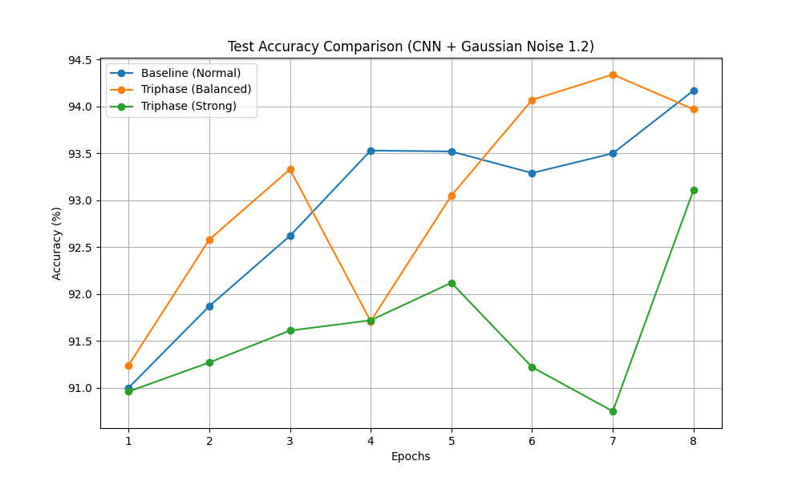
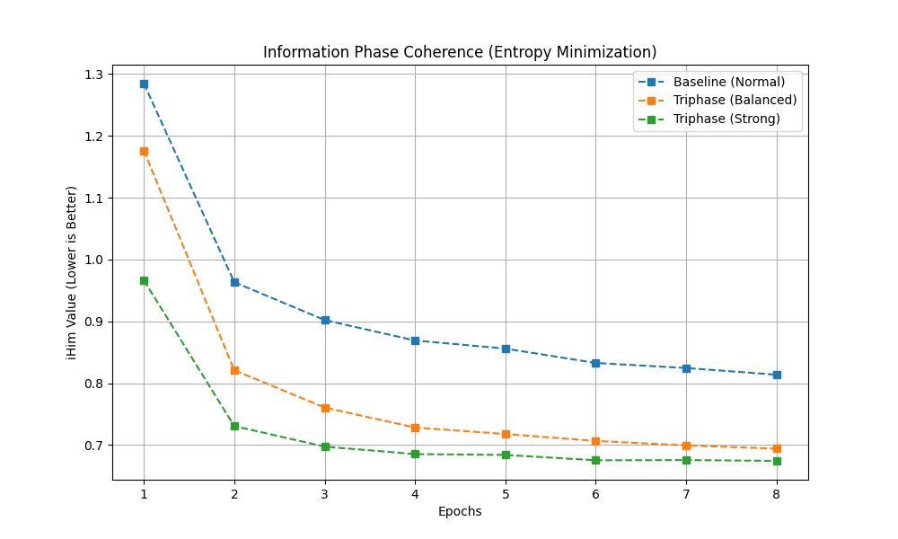

# Triphase Optimizer: A Physics-Inspired Loss Function for Coherence-Driven Learning

Triphase Optimizer is a physics-inspired loss function that enhances learning stability, coherence, and robustness.  
It models training dynamics as an interference process between three components:

1. Positive Phase (H+): CrossEntropy (accuracy)
2. Negative Phase (H-): L2 regularization (structural stability)
3. Imaginary Phase (iHim): Entropy minimization (information coherence)

This combination makes models more resilient in high-noise or high-entropy training environments.

---

## Features

- Works as a drop-in replacement for CrossEntropy-based losses
- Improves noise robustness and confidence calibration
- Reduces predictive entropy
- Compatible with any PyTorch model and optimizer
- Lightweight implementation

---

## Installation

### Clone the repository

```bash
git clone https://github.com/y-fujihira/triphase-optimizer.git
cd triphase-optimizer
```

### Install dependencies

```bash
pip install torch torchvision matplotlib
```

---

## Usage Example (PyTorch)

### TriphaseLoss class

```python
import torch
import torch.nn as nn
import torch.nn.functional as F

class TriphaseLoss(nn.Module):
    def __init__(self, alpha=0.0005, beta=0.2):
        super().__init__()
        self.alpha = alpha
        self.beta = beta

    def forward(self, outputs, targets, model):
        l_pos = F.cross_entropy(outputs, targets)
        l_neg = sum((p ** 2).sum() for p in model.parameters())
        probs = F.softmax(outputs, dim=1)
        log_probs = F.log_softmax(outputs, dim=1)
        l_im = -(probs * log_probs).sum(dim=1).mean()
        return l_pos + self.alpha * l_neg + self.beta * l_im
```

### Training Loop Example

```python
model = YourModel()
criterion = TriphaseLoss(alpha=0.0005, beta=0.2)
optimizer = torch.optim.SGD(model.parameters(), lr=0.01)

for data, target in dataloader:
    optimizer.zero_grad()
    output = model(data)
    loss = criterion(output, target, model)
    loss.backward()
    optimizer.step()
```

---

## Experimental Results

Experiments were performed using a CNN trained on MNIST with Gaussian noise (σ=1.2) applied to training images.

### Test Accuracy

```
Triphase (Balanced) > Baseline after later epochs
Strong Triphase: Stable but slightly lower performance
```



### Information Coherence (Entropy Minimization)

Lower iHim indicates better coherence.
Triphase Optimizer consistently reduces entropy more than the baseline.



---

## Recommended Hyperparameters

| Parameter | Purpose                 | Typical Range |
| --------- | ----------------------- | ------------- |
| alpha     | Structural tension (L2) | 1e-4 to 1e-2  |
| beta      | Coherence strength      | 0.1 to 0.5    |

Setting both alpha and beta to zero produces baseline CrossEntropy behavior.

---

## Project Structure

```text
.
├── experiment.py
├── result_accuracy.png
├── result_coherence.png
├── README.md
├── README_JA.md
└── pdf/
    └── Triphase_Cosmology__Interference_Structure_of_the_Universe.pdf
```

The PDF contains the theoretical foundation but is not required to use the loss function.

---

## Citation

```bibtex
@misc{triphase2025,
  title={Triphase Optimizer: A Physics-Inspired Loss Function for Coherence-Driven Learning},
  author={Fujihira, Yoza},
  year={2025},
  howpublished={GitHub Repository},
  url={https://github.com/y-fujihira/triphase-optimizer}
}
```

---

## License

MIT License

## Japanese Documentation

日本語のドキュメント: [README\_JA.md](README_JA.md)

---
